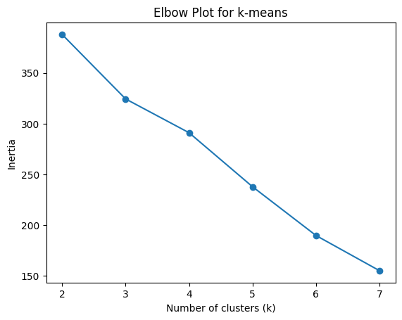
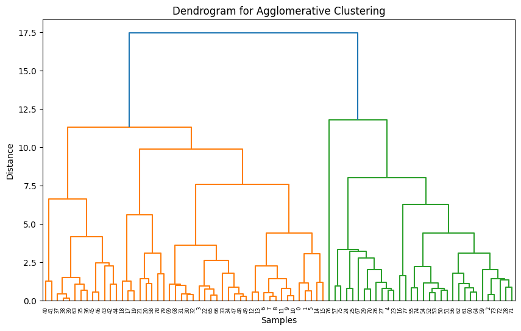
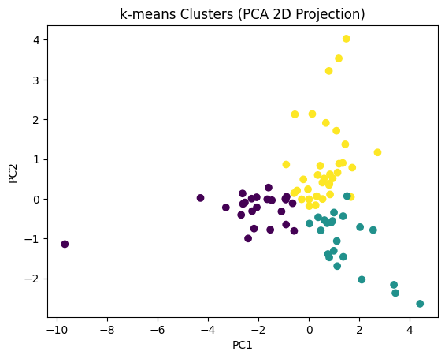

# Project Four: Identifying Bank Financial Performance Patterns Through Clustering (2005-2024)

**INTRODUCTION:**

In this project, I focus on exploring patterns within financial performance data for major U.S. banks. The main question I want to answer is: Do banks exhibit natural groupings or “clusters” based on their financial health over time? My dataset includes yearly financial metrics for the Big Four banks (Bank of America, Wells Fargo, JPMorgan Chase, and Citigroup) from 2005-2024, containing variables such as total assets, revenue, net income, ROA, ROE, profit margin, and equity-to-assets ratios.

Because the dataset spans major economic events like the 2008 crisis, the 2020 pandemic, and recent Federal Reserve rate hikes, I want to see whether those fluctuations create meaningful differences between banks or across years. To investigate this, I will use clustering methods, such as k-means and possibly agglomerative clustering, to group years that share similar financial characteristics and identify what distinguishes stable vs. high-risk periods. The goal is to discover whether banks behave similarly during certain economic environments or if certain institutions consistently diverge from the others.

Overall, this project aims to tell a story about how banks shift into different “financial states” over time and what underlying features drive those patterns. Clustering will help uncover hidden structure that might not appear through simple descriptive statistics alone.

**WHAT IS CLUSTERING?**

Clustering is a machine learning method that groups data points based on how similar they are. It’s an unsupervised technique, which means we don’t give the algorithm any labels or categories ahead of time. Instead, the algorithm tries to discover patterns on its own and place the data into groups that make sense based on the features.

A common method is k-means clustering, where you pick a number of clusters, and the algorithm tries to organize the data into those groups by measuring distances between points. Another option is agglomerative hierarchical clustering, which starts with each point in its own group and slowly merges the closest points together. Both methods help reveal structure in the data that isn’t obvious at first.

Clustering is useful in my project because my bank dataset doesn’t tell me which years were “similar” or “different.” By using clustering, I can let the algorithm find groups of years that share similar financial behaviors. This helps me see patterns in bank performance across events like the 2008 recession or the pandemic, without needing labels already provided.

**THE DATA:**

For this project, I am using a dataset that I built myself from SEC 10-K filings for the Big Four U.S. banks: Bank of America, Wells Fargo, JPMorgan Chase, and Citigroup. The dataset covers the years 2005 through 2024, which includes major economic events such as the 2008 financial crisis, the COVID-19 pandemic, and recent changes in Federal Reserve interest rates.

The data includes yearly financial metrics that describe each bank’s performance. 

**FEATURES:**

**Total Assets:** measures the size of the bank

**Total Equity:** shareholder equity and financial strength

**Total Revenue:** income generated before expenses

**Net Income:** profitability in a given year

**ROA (Return on Assets):** profitability relative to total assets

**ROE (Return on Equity):** profitability relative to equity

**Profit Margin:** percentage of revenue converted to net income

**Equity-to-Assets:** used to reflect financial leverage and stability (the bigger the ratio the better)

**Asset Turnover:** finds how efficiently a bank uses it assets to generate revenue

These variables help capture both the size of the bank and the efficiency of its operations. I collected the numbers by reading each bank’s annual report and copying the values into a CSV file. Because the names of the features are already clear, most of them do not need extra explanation, but they all represent important financial indicators that can show how strong or risky a bank might be in a given year.

This dataset works well for clustering because it contains multiple numeric variables and many years of performance data, which allows me to compare banks over time and see whether certain years naturally fall into groups based on their financial characteristics.

**DATA UNDERSTANDING / VISUALIZATION:**

To understand the bank dataset, I created several basic visualizations. I used line charts to see how the financial metrics changed from 2005-2024, which helped me notice major shifts during events like the 2008 recession and the 2020 pandemic. I also made histograms to check the distributions of variables such as ROA, ROE, and profit margin, which helped me see if any features had outliers or large spreads. Then I used a correlation heatmap and scatterplot matrix to understand how the different financial features were related to one another.

These visualizations were important because they helped me prepare for the clustering model. For example, seeing the wide scale differences and outliers showed me that the data needed scaling before clustering so that features with larger values (like total assets) wouldn’t overpower smaller ones (like ROA). The correlations also helped me see which features carried similar information, which influenced how I selected variables for my clustering model. Overall, the visual analysis gave me a clearer picture of the data and guided the decisions I made before building the actual clusters.

**PREPROCESSING THE DATA:**

Before running the clustering model, I had to prepare the dataset so that all the features were on a similar scale and ready for analysis. One of the first steps I took was checking for any missing values or incorrect entries. Since the CSV was created manually from 10-K filings, I made sure each year for each bank had complete values for the main financial metrics. In the few cases where numbers were slightly inconsistent across reports, I corrected them using the official values from the filings.

Next, I focused on scaling the data, which is important for clustering. Some features, like total assets or total equity, have much larger numerical ranges than ratios like ROA or profit margin. If I didn’t scale the data, the clustering model would think the “bigger” features were more important just because of their size. To fix this, I used standardization, which transforms each feature so that it has a mean of 0 and a standard deviation of 1. This puts everything on the same level and prevents any single feature from dominating the distance calculations.

I also selected the features that made the most sense for clustering. Instead of using every column, I focused on the variables that describe financial performance, such as ROA, ROE, profit margin, equity-to-assets, asset turnover, revenue, and net income. These features capture the quality and stability of each bank’s performance and relate directly to whether a year might fall into a “strong,” “average,” or “risky” cluster. After checking correlations and visual patterns, I removed any duplicate or overly similar features to avoid giving the model redundant information.

By cleaning, scaling, and selecting the right financial features, the dataset became ready for clustering and set a strong foundation for building meaningful groups.

**MODELING:**

For this project, I decided to use two clustering methods:

**k-means clustering**

and

**agglomerative hierarchical clustering**

I chose these models because they both work well with numeric data and can reveal natural groupings based on financial performance. Since my dataset contains standardized financial features such as ROA, ROE, profit margin, and net income, both models can measure similarity between years and group them based on how alike they are. Trying more than one clustering method gives me a better chance of finding patterns that might not appear from just a single model.

k-means was my first choice because it is simple, fast, and works well when the data has fairly clear cluster shapes. Since my data is already scaled and uses numeric features, k-means can quickly find patterns in the financial ratios and profitability measures. It also gives centroids, which makes it easy to interpret what an “average” year in each cluster looks like. This helps me answer my main question about whether banks move through different financial states over time.

I also used agglomerative hierarchical clustering because it does not require me to choose the number of clusters right away. Instead, it builds clusters step-by-step by merging the closest points together. This model is helpful when I want to explore the structure of the data and see whether the clusters form gradually or in distinct jumps. The dendrogram created by hierarchical clustering gives a visual summary of how years connect to each other based on financial similarity, which is another way to understand how banks behaved across different economic periods.

Using both models allows me to compare their results and see if they find similar patterns. If both clustering methods group certain years together, like recession years or strong growth years, that makes the patterns more trustworthy.

**MODELING PART 2:**

Both k-means and agglomerative hierarchical clustering have different strengths, so comparing them helps me understand my bank dataset from more than one angle.

k-means has the advantage of being very fast and easy to interpret. Because it produces centroids, I can look at each cluster’s “average” year and immediately see whether the cluster represents strong financial performance, weak performance, or something in between. This is helpful for my goal of identifying whether the banks move in and out of different financial states across time. However, one limitation of k-means is that it requires choosing the number of clusters ahead of time. It also works best when clusters are roughly spherical and evenly sized, which may not always be true for financial data.

On the other hand, agglomerative hierarchical clustering doesn’t require me to pick the number of clusters at the start. Instead, it shows how the data naturally groups together at different levels through a dendrogram. This makes it easier to see whether certain years, like the 2008 crisis or the early pandemic years, merge early or late in the process. That kind of visual structure is helpful for understanding trends in bank performance. The main drawback is that hierarchical clustering can be slower on larger datasets and doesn’t produce simple centroids the way k-means does, which can make cluster interpretation a little harder.

Using both models gives me a more complete understanding of the data. If k-means and hierarchical clustering group similar years together, for example, crisis years forming one cluster and stable years forming another, then I can feel more confident that the patterns reflect real financial behavior rather than just quirks of one algorithm. Because my dataset is not extremely large and has clear numeric features, both models fit well with the type of analysis I want to do. Comparing their results helps strengthen the conclusions about how banks’ financial performance shifts over different economic conditions.

**MODELING IMPLEMENTATION:**

To actually run the clustering models, I used Python with pandas, scikit-learn, and matplotlib. After preprocessing, I had a standardized feature matrix called X_scaled that included the main financial variables (ROA, ROE, profit margin, equity_to_assets, asset_turnover, revenue, and net_income).

**k-means clustering code**

First, I ran k-means for different values of k so I could see how many clusters might make sense:

```python
from sklearn.cluster import KMeans
import matplotlib.pyplot as plt

inertias = []
k_values = range(2, 8)

for k in k_values:
    kmeans = KMeans(n_clusters=k, random_state=42)
    kmeans.fit(X_scaled)
    inertias.append(kmeans.inertia_)

plt.figure()
plt.plot(k_values, inertias, marker="o")
plt.xlabel("Number of clusters (k)")
plt.ylabel("Inertia")
plt.title("Elbow Plot for k-means")
plt.show()
```



**INTERPRETATION:**

The elbow plot shows how the k-means inertia changes as the number of clusters increases. At first, inertia drops quickly when moving from 2 to 3 clusters, but after k = 3, the decrease becomes more gradual. This “bend” or elbow at k = 3 suggests that three clusters provide a good balance between model complexity and fit. Adding more clusters after that point does not significantly improve the within-cluster similarity, so I chose k = 3 as the number of clusters for my k-means model.

```python
from scipy.cluster.hierarchy import dendrogram, linkage
import matplotlib.pyplot as plt

Z = linkage(X_scaled, method="ward")

plt.figure(figsize=(10, 6))
dendrogram(Z)
plt.title("Dendrogram for Agglomerative Clustering")
plt.xlabel("Samples")
plt.ylabel("Distance")
plt.show()
```



**INTERPRETATION:**

The dendrogram shows how the agglomerative clustering algorithm gradually merges individual years into larger clusters based on their financial similarity. At the bottom of the plot, each leaf represents a single observation, and as you move up, branches combine into larger groups. There is a noticeable height jump where three main branches remain before merging into one, which is consistent with the three-cluster choice from the elbow plot. Cutting the dendrogram at this height would produce three main clusters, suggesting that the data naturally separates into three financial performance groups across the years.

```python
from sklearn.cluster import KMeans
from sklearn.decomposition import PCA
import matplotlib.pyplot as plt

k_optimal = 3

kmeans_final = KMeans(n_clusters=k_optimal, random_state=42)
kmeans_labels = kmeans_final.fit_predict(X_scaled)

pca = PCA(n_components=2)
X_pca = pca.fit_transform(X_scaled)

plt.figure()
plt.scatter(X_pca[:, 0], X_pca[:, 1], c=kmeans_labels)
plt.xlabel("PC1")
plt.ylabel("PC2")
plt.title("k-means Clusters (PCA 2D Projection)")
plt.show()
```



**INTERPRETATION:**

The PCA scatter plot reduces the high-dimensional financial data into two principal components, allowing the clusters to be visualized in a 2D space. Each point represents a bank-year observation, and the color indicates which k-means cluster it belongs to. While the clusters are not perfectly separated (which is expected with real financial data), there are clear groupings where points in the same cluster tend to be closer together. This suggests that the clustering model is capturing meaningful patterns in the data. The plot supports the idea that the years can be divided into roughly three financial “states,” with some years grouped into stronger performance clusters and others grouped into weaker or more stressed financial conditions.

**EVALUATING THE MODELS:**

To evaluate how well the clustering models performed, I compared the results from the elbow plot, the hierarchical dendrogram, and the PCA scatterplot. All three visuals pointed toward the same overall conclusion: the bank-year data naturally forms three meaningful clusters based on financial performance. The elbow plot suggested that k = 3 was the most efficient number of clusters, since adding more clusters beyond that point did not give much improvement. The dendrogram supported this by showing a clear height jump where the data naturally splits into three major groups before merging into one large cluster.

The PCA scatterplot gave another way to check whether the clusters made sense visually. Even though financial data is complex and not perfectly separable in a two-dimensional space, the points still tended to form three noticeable groupings. Seeing similar patterns across all three methods increases confidence that the clusters reflect real financial behavior rather than noise or randomness.

Each model also brought its own strengths and weaknesses. K-means was fast and made interpretation simple by giving centroids that show what an “average” year in each cluster looks like. Hierarchical clustering added value by showing how the clusters form step-by-step, which made it easier to see which years were most similar to each other. The downside is that hierarchical clustering can be harder to interpret without centroids, while k-means depends on choosing a good value for k. Even with these limitations, the consistency across both models suggests that the clusters are stable and meaningful.

Overall, the evaluation shows that the clustering results are reliable, and the identified clusters provide a useful way to understand how the Big Four banks shifted through different financial states across major economic events.

**STORYTELLING:**

Once the clusters were formed and visualized, the patterns began to tell a clear story about how the Big Four banks moved through different financial “states” from 2005 to 2024. The clustering results showed that these banks did not behave randomly or independently across the years. Instead, they shifted together into groups that reflected the broader economic environment. This became most obvious when comparing the clusters to major events like the 2008 financial crisis, the recovery years that followed, and the disruption caused by the 2020 pandemic.

One of the clusters contained years with noticeably lower profitability measures, weaker margins, and signs of stress, this cluster aligned closely with recession periods or unusual macroeconomic shocks. These years grouped together regardless of which bank the numbers came from, showing that large economic events push even major banks into similar financial positions. Another cluster represented strong performance years, where ROA, ROE, and profit margins were higher and more consistent. This group aligned with expansion periods, such as the mid-2010s when the economy was stable and bank profitability steadily improved. The third cluster fell between these two extremes, reflecting transition years where the banks were not performing poorly, but not yet returning to full strength either.

These clusters helped answer the main question of the project: Yes, the banks do fall into natural financial groupings over time. The patterns were not random, years with similar economic conditions consistently ended up in the same cluster. This means clustering successfully captured the “states” that the banks moved through, even without any labels such as “crisis year,” “recovery year,” or “growth year.” What made this especially meaningful is that both k-means and hierarchical clustering told the same story, suggesting the results were not model-dependent but instead reflected real patterns in the financial data.

The clustering also revealed insights I did not expect at the start. For example, some transition years grouped more closely with stable years than with crisis years, showing that banks bounce back at different speeds depending on conditions. The PCA visualization made these subtle differences clearer by showing how some years sit closer to cluster boundaries, indicating intermediate financial states. Together, these insights paint a more complete picture of how banks evolve over time and how sensitive they are to major economic events.

Overall, the clusters did not just divide the data, they highlighted how economic cycles shape the behavior of the largest banks. The analysis showed that financial performance is not isolated year-by-year, but instead follows patterns that can be discovered through data mining. This allowed me to understand the dataset not just statistically, but as a story of how banks navigate strong years, weak years, and everything in between.

**IMPACT:**

Even though this project is based on public financial data and simple clustering models, it still has potential social and ethical impacts. At a basic level, the analysis shows how banks move through different financial “states” over time, which can influence how people think about risk, stability, and trust in large financial institutions. If a similar clustering approach were used by investors, regulators, or even the banks themselves, it could shape decisions about lending, regulation, or where to put money during uncertain periods.

On the positive side, clustering financial performance in this way could help identify early warning signs of stress. If certain patterns in ROA, ROE, profit margin, and equity-to-assets tend to show up in “risky” clusters, then policymakers or risk managers could act sooner to stabilize banks before a crisis spreads. This could protect customers, employees, and communities from the worst effects of financial downturns. In that sense, this kind of analysis might support more informed decision-making and better transparency around how banks are actually doing.

However, there are also possible negative impacts. If clustering models are treated as “objective truth” when they are really just simplifications, people might overreact or misinterpret the results. For example, labeling certain years or banks as “high-risk” based only on a model could affect reputation, stock prices, or public confidence, even if the underlying context is more nuanced. There is also a fairness concern: models built on historical data may reinforce the same patterns and biases that already exist in the financial system, such as favoring larger, more stable institutions and making smaller or more volatile ones look worse by comparison.

Another ethical consideration is how this kind of analysis might be used if combined with non-public data. While my project only uses public 10-K filings, real-world versions could involve internal, sensitive information. In that case, there would be privacy concerns, power imbalances, and questions about who gets access to the insights and who is impacted by the decisions that follow. Overall, this project shows that even a “simple” clustering analysis is not neutral, it can influence how we view financial health, how we assign risk, and who ends up bearing the consequences of those judgments.

**REFERENCES:**

U.S. Securities and Exchange Commission. (n.d.). Search filings (EDGAR database). U.S. Securities and Exchange Commission. Retrieved September 29, 2025, from https://www.sec.gov/search-filings

Franck, T. (2022, December 27). How Bank of America came back from the brink of collapse. CNBC. Retrieved September 29, 2025, from https://www.cnbc.com/2022/12/27/how-bofa-came-back-from-the-brink-of-collapse.html

Peters, R. (2015, June 28). A brief history of Bank of America in crisis. The Motley Fool. Retrieved September 29, 2025, from https://www.fool.com/investing/general/2015/06/28/a-brief-history-of-bank-of-america-in-crisis.aspx
