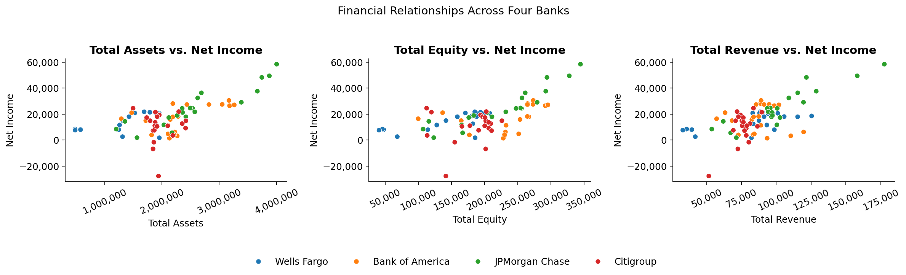
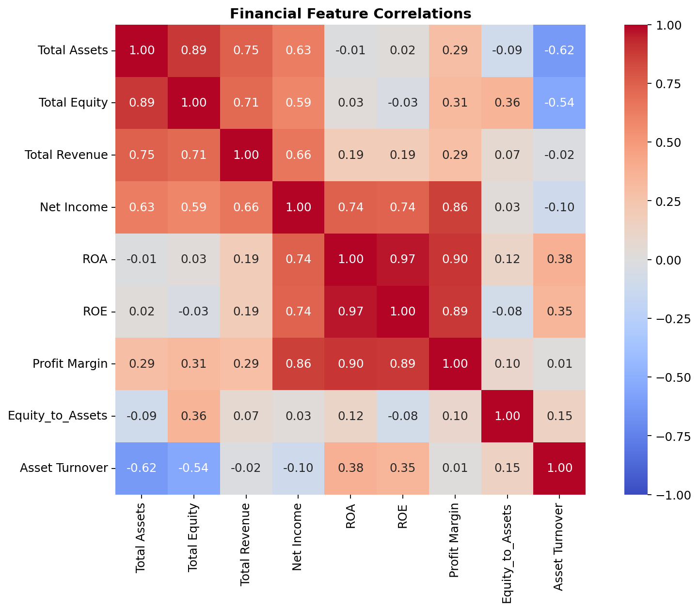
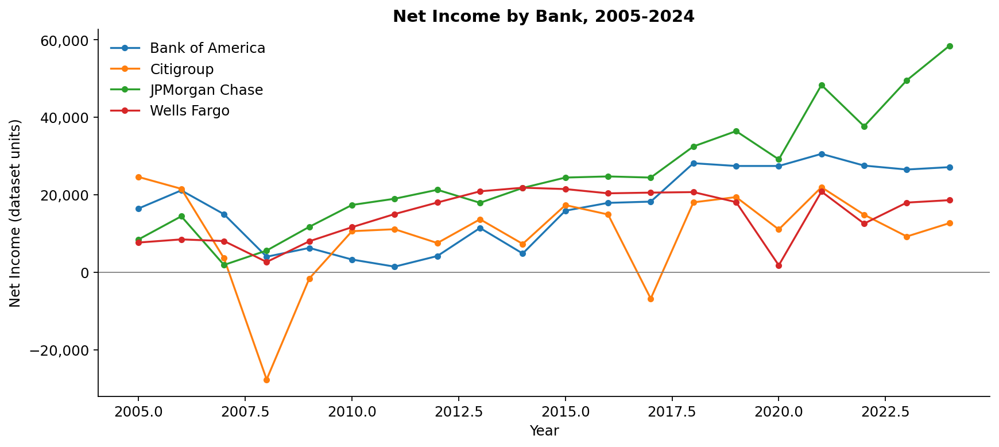
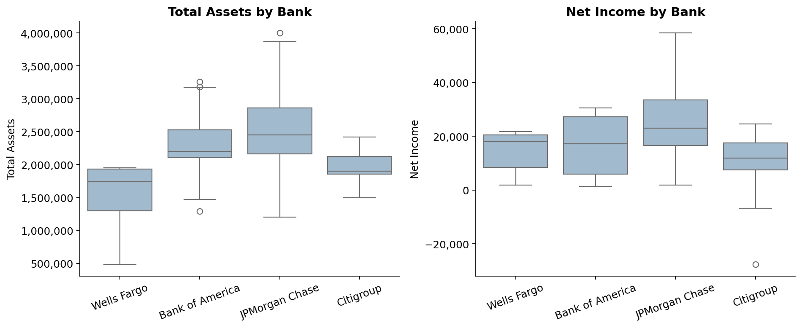
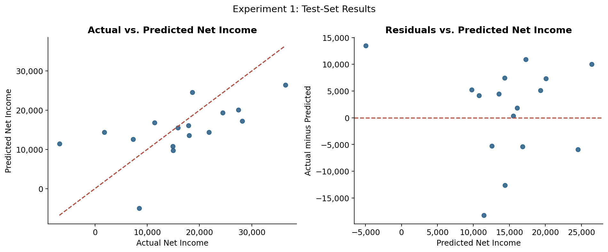
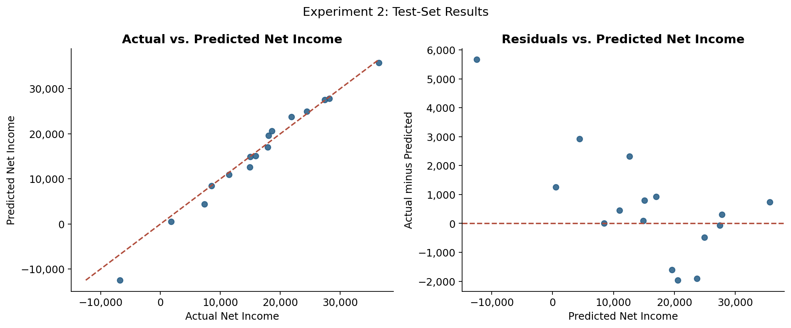
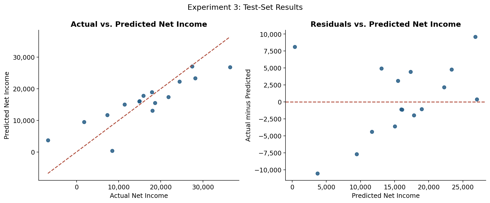

# Project Three: Analyzing Bank Profitability with Linear and Ridge Regression (2005-2024)

**INTRODUCTION:**

In this project, I explore how financial characteristics influence bank profitability using regression analysis. The goal is to predict a key performance metric (Net Income) for the four largest U.S. commercial banks (Bank of America, JPMorgan Chase, Citigroup, and Wells Fargo) based on their financial data from 2005 to 2024. By analyzing how variables such as Total Assets, Total Equity, and Total Revenue relate to profitability, this project aims to uncover the patterns that help explain how a bank's size, efficiency, and balance-sheet affect earnings.

The dataset was manually compiled from each bank’s SEC 10-K annual reports, resulting in a consistent panel of financial metrics spanning 20 years. Each record represents a specific bank and year, with features including:

**Total Assets:** overall resources owned by the bank

**Total Equity:** shareholder ownership value

**Total Revenue:** total income generated before expenses

**Net Income:** final profit after all costs (used here as the target variable)

**ROA, ROE, Profit Margin, Asset Turnover, and Equity-to-Assets ratios:** derived indicators of efficiency and leverage

**Bank Name and Year:** categorical and temporal features for context

This dataset is a great foundation for a regression problem because it captures continuous financial relationships that evolve. Through this analysis, I aim to build models that can not only estimate profitability but also provide insights into which financial characteristics most strongly drive performance within the banking sector.

**REGRESSION AND HOW IT WORKS:**

Regression is a statistical technique used to model and analyze the relationship between a dependent variable (the value we want to predict) and one or more independent variables (the predictors or features). The main purpose of regression is to estimate how changes in the independent variables are associated with changes in the dependent variable.

In this project, I focus on linear regression, one of the most fundamental and widely used regression methods. Linear regression assumes that the relationship between the dependent variable y and the independent variables x1, x2...xn can be expressed as a straight line.

ŷ= β0 + β1x1 + β2x2 + ... βnxn

In this equation: 

**ŷ:** The predicted value of the dependent variables.
**β0:** The intercept that represents the predicted value when all of the x's are = to zero.
**β1 - βn:** The coefficients which show how much y will change for a one unit change in each of the predictors (x) while holding everything else constant. 

The model learns these coefficients by minimizing the SSE (Sum of Squared Errors) between the predicted values and actual values. 

This method finds the line that best fits the data by making these squared differences as small as possible.

Once fitted, the model can be used to predict new values of y for whatever x inputs and to interpret the influence of each independent variable. For example, a positive coefficient indicates that an increase in that variable is associated with an increase in the predicted outcome, whereas a negative coefficient suggests the opposite.

SSE = Summation of (yi - ŷi)^2

**EXPERIMENT 1: DATA-UNDERSTANDING:**

Before building any regression models, I began by gaining an initial understanding of the dataset to identify trends, patterns, and relationships among the financial variables. The dataset includes annual financial data for the four largest U.S. banks, Bank of America, JPMorgan Chase, Citigroup, and Wells Fargo, from 2005 to 2024. Each record represents one bank in one year, with features such as Total Assets, Total Equity, Total Revenue, Net Income, ROA, ROE, Profit Margin, Asset Turnover, and Equity-to-Assets.

To understand the structure of the data, I first examined summary statistics (mean, median, minimum, and maximum) to check for outliers and to see how each feature is distributed. Then I created visualizations to explore the relationships among variables and identify potential multicollinearity:

**Pairplot / scatterplots:** used to visualize how Total Assets, Total Revenue, and Net Income move together across different years.

**Correlation heatmap:** revealed that Total Assets, Total Revenue, and Total Equity were all highly correlated, suggesting that banks with larger asset bases also tend to generate higher revenue and profits.

**Line plots over time:** helped visualize growth trends from 2005 to 2024 and highlighted economic downturns (such as 2008-2009 and 2020), where changes in profitability can be compared across banks.

**Boxplots grouped by bank:** provided insight into how each bank differs in size and profitability distributions over the 20-year period.

From this initial exploration, I observed that the dataset shows strong linear relationships among the major financial metrics, making it a suitable candidate for linear regression modeling. However, the high correlation between certain features indicated a need to watch for multicollinearity, which could affect coefficient interpretability in any of my other experiments.

```python
import pandas as pd

df = pd.read_csv('Big4_Banks_2005_2024_combined.csv')
```

**FINANCIAL RELATIONSHIPS:**

```python
import matplotlib.pyplot as plt
import seaborn as sns
from matplotlib.ticker import StrMethodFormatter

fig, axes = plt.subplots(1, 3, figsize=(15, 4.5))
for ax, feature in zip(axes, ['Total Assets', 'Total Equity', 'Total Revenue']):
    sns.scatterplot(data=df, x=feature, y='Net Income', hue='Bank', ax=ax)
    ax.set_title(f'{feature} vs. Net Income')
    ax.xaxis.set_major_formatter(StrMethodFormatter('{x:,.0f}'))
    ax.yaxis.set_major_formatter(StrMethodFormatter('{x:,.0f}'))
    ax.tick_params(axis='x', labelrotation=25)
    ax.get_legend().remove()
handles, labels = axes[0].get_legend_handles_labels()
fig.legend(handles, labels, loc='lower center', ncol=4, frameon=False)
fig.suptitle('Financial Relationships Across Four Banks')
plt.tight_layout(rect=[0, 0.13, 1, 0.95])
plt.show()
```



**FINANCIAL CORRELATIONS:**

```python
features = ['Total Assets', 'Total Equity', 'Total Revenue', 'Net Income',
            'ROA', 'ROE', 'Profit Margin', 'Equity_to_Assets', 'Asset Turnover']
plt.figure(figsize=(11, 8))
sns.heatmap(df[features].corr(), annot=True, fmt='.2f', cmap='coolwarm',
            vmin=-1, vmax=1, center=0, square=True)
plt.title('Financial Feature Correlations')
plt.tight_layout()
plt.show()
```



**NET INCOME OVER TIME:**

```python
fig, ax = plt.subplots(figsize=(11, 5))
for bank, group in df.groupby('Bank'):
    group = group.sort_values('Year')
    ax.plot(group['Year'], group['Net Income'], marker='o', markersize=4, label=bank)
ax.axhline(0, color='gray', linewidth=0.8)
ax.set(title='Net Income by Bank, 2005-2024', xlabel='Year', ylabel='Net Income (dataset units)')
ax.yaxis.set_major_formatter(StrMethodFormatter('{x:,.0f}'))
ax.legend(frameon=False)
plt.tight_layout()
plt.show()
```



**FINANCIAL DISTRIBUTIONS BY BANK:**

```python
fig, axes = plt.subplots(1, 2, figsize=(12, 5))
for ax, feature in zip(axes, ['Total Assets', 'Net Income']):
    sns.boxplot(data=df, x='Bank', y=feature, color='#9bbbd4', ax=ax)
    ax.set_title(f'{feature} by Bank')
    ax.set_xlabel('')
    ax.tick_params(axis='x', labelrotation=20)
    ax.yaxis.set_major_formatter(StrMethodFormatter('{x:,.0f}'))
plt.tight_layout()
plt.show()
```



**EXPERIMENT 1: PRE-PROCESSING:**

For the first experiment, I selected Total Assets, Total Equity, and Total Revenue as predictors, with Net Income as the target variable. These measures represent bank size, shareholder equity, and revenue generation.

The code uses an 80% training and 20% testing split with random_state=42. It does not apply missing-value imputation, bank dummy encoding, or feature standardization. The same split settings are used across all three experiments.

**EXPERIMENT 1: MODELING:**

For the first experiment, I built a linear regression model using the LinearRegression class from scikit-learn. This model applies ordinary least squares (OLS) to find the best-fitting line that minimizes the residual sum of squares between the observed target values and the model’s predicted values.

```python
import pandas as pd
from sklearn.linear_model import LinearRegression
from sklearn.model_selection import train_test_split

df = pd.read_csv('Big4_Banks_2005_2024_combined.csv')

X = df[['Total Assets', 'Total Equity', 'Total Revenue']]
y = df['Net Income']

X_train, X_test, y_train, y_test = train_test_split(X, y, test_size=0.2, random_state=42)

model = LinearRegression(fit_intercept=True)
model.fit(X_train, y_train)
```

*How the model works*

The algorithm estimates a coefficient βi for each independent variable that best explains the variation in the dependent variable y.

*The breakdown*

**ŷ:** The predicted value of Net Income.
**β0:** The intercept.
**β1 - β3:** How each feature contributes to Net Income.

The model automatically learns these coefficients by minimizing the sum of squared errors between the actual and predicted values.

*Model parameters*

The key parameter used was fit_intercept = True, which essentially instructs the model to estimate an intercept term so predictions aren’t forced through the origin. All other parameters were left at their defaults (copy_X=True, positive=False), which are appropriate for dense numeric data like this dataset. This baseline model establishes the foundation for comparison with later experiments, where I will add engineered features and transformations to improve accuracy.

**EXPERIMENT 1: EVALUATION:**

After fitting the baseline linear regression model, the next step was to evaluate its performance on unseen data. To do this, I used two key metrics: the Root Mean Squared Error (RMSE) and the Coefficient of Determination (R^2). 

RMSE summarizes the magnitude of differences between the model’s predicted values and the actual values, giving a sense of how far off the predictions are in the same units as the target variable.

RMSE = Square root ( 1/n * (Summation of (yi - ŷi)^2) )

In words, RMSE is the square root of the average of all squared differences between the actual and predicted Net Income values. Lower RMSE values indicate a better fit.

R^2 measures how well the model explains the variability in the target variable. An R^2 value close to 1 means the model explains most of the variation in Net Income, while a value near 0 means it explains very little.

```python
from sklearn.metrics import mean_squared_error, r2_score
import numpy as np

y_pred = model.predict(X_test)

rmse = np.sqrt(mean_squared_error(y_test, y_pred))
r2 = r2_score(y_test, y_pred)

print("Root Mean Squared Error (RMSE):", rmse)
print("R² Score:", r2)
```

```python
fig, axes = plt.subplots(1, 2, figsize=(12, 5))
axes[0].scatter(y_test, y_pred, color='#245c85', alpha=0.85)
limits = [min(y_test.min(), y_pred.min()), max(y_test.max(), y_pred.max())]
axes[0].plot(limits, limits, linestyle='--', color='#b04c3b')
axes[0].set(title='Actual vs. Predicted Net Income', xlabel='Actual Net Income', ylabel='Predicted Net Income')
axes[1].scatter(y_pred, y_test - y_pred, color='#245c85', alpha=0.85)
axes[1].axhline(0, linestyle='--', color='#b04c3b')
axes[1].set(title='Residuals vs. Predicted Net Income', xlabel='Predicted Net Income', ylabel='Actual minus Predicted')
for ax in axes:
    ax.xaxis.set_major_formatter(StrMethodFormatter('{x:,.0f}'))
    ax.yaxis.set_major_formatter(StrMethodFormatter('{x:,.0f}'))
fig.suptitle('Experiment 1: Test-Set Results')
plt.tight_layout()
plt.show()
```



Root Mean Squared Error (RMSE): 8614.879586272604
R² Score: 0.29762961598357507

These metrics provided a quantitative measure of how well the model performed on new data.

For the baseline model, the RMSE represented the root mean squared prediction error in Net Income (in millions of dollars, depending on dataset scale), while the R^2 score showed how much of the variation in Net Income could be explained by Total Assets, Total Equity, and Total Revenue alone.

Although the model captured the general relationship between these financial indicators and profitability, there was still room for improvement. In the next experiments, I plan to enhance performance by introducing ratio-based features, handling multicollinearity, and testing alternative regression methods.

**EXPERIMENT 2:**

For the second experiment, I focused on improving the baseline model by addressing two key areas identified in Experiment 1:

(1). high correlation among the raw financial variables, and
(2). limited feature variety that might have restricted predictive power.

*Changes from Experiment 1:*

Instead of using only the raw balance sheet totals, I introduced several ratio-based and transformed features that better capture a bank’s operational efficiency and profitability.
Specifically, I added:

**ROA (Return on Assets) = Net Income / Total Assets**

**ROE (Return on Equity) = Net Income / Total Equity**

**Profit Margin = Net Income / Total Revenue**

**log(Total Assets)** - a logarithmic transformation to reduce the large scale difference across banks.

The new model used the following predictors:
log(Total Assets), ROA, ROE, Profit Margin, and Equity-to-Assets.

These variables emphasize efficiency and scale rather than just raw size, which should provide a more stable relationship with Net Income.

```python
import numpy as np

df['ROA'] = df['Net Income'] / df['Total Assets']
df['ROE'] = df['Net Income'] / df['Total Equity']
df['Profit Margin'] = df['Net Income'] / df['Total Revenue']
df['log_Assets'] = np.log(df['Total Assets'])

X = df[['log_Assets', 'ROA', 'ROE', 'Profit Margin', 'Equity_to_Assets']]
y = df['Net Income']

X_train, X_test, y_train, y_test = train_test_split(X, y, test_size=0.2, random_state=42)
model2 = LinearRegression()
model2.fit(X_train, y_train)

y_pred2 = model2.predict(X_test)
rmse2 = np.sqrt(mean_squared_error(y_test, y_pred2))
r2_2 = r2_score(y_test, y_pred2)
print("RMSE:", rmse2)
print("R²:", r2_2)
```

```python
fig, axes = plt.subplots(1, 2, figsize=(12, 5))
axes[0].scatter(y_test, y_pred2, color='#245c85', alpha=0.85)
limits = [min(y_test.min(), y_pred2.min()), max(y_test.max(), y_pred2.max())]
axes[0].plot(limits, limits, linestyle='--', color='#b04c3b')
axes[0].set(title='Actual vs. Predicted Net Income', xlabel='Actual Net Income', ylabel='Predicted Net Income')
axes[1].scatter(y_pred2, y_test - y_pred2, color='#245c85', alpha=0.85)
axes[1].axhline(0, linestyle='--', color='#b04c3b')
axes[1].set(title='Residuals vs. Predicted Net Income', xlabel='Predicted Net Income', ylabel='Actual minus Predicted')
for ax in axes:
    ax.xaxis.set_major_formatter(StrMethodFormatter('{x:,.0f}'))
    ax.yaxis.set_major_formatter(StrMethodFormatter('{x:,.0f}'))
fig.suptitle('Experiment 2: Test-Set Results')
plt.tight_layout()
plt.show()
```



**UPDATED MODEL**

RMSE: 1939.8401136550651
R²: 0.9643877314674346

Compared to the baseline model, the second regression produced a lower RMSE and a higher R². However, ROA, ROE, and Profit Margin contain Net Income, which is also the target variable. This overlap introduces target leakage, so the stronger scores do not establish an ability to forecast unknown future profits.

This experiment shows why feature engineering must consider how predictors are calculated, as well as how they affect reported accuracy.

**EXPERIMENT 3:**

For the third experiment, I aimed to further improve model performance and stability by introducing regularization ,  specifically, Ridge Regression. While ordinary linear regression minimizes the sum of squared errors, Ridge regression adds a penalty term to the cost function that discourages excessively large coefficients. This helps reduce the effects of multicollinearity and overfitting, especially when predictors are correlated, as was observed in the earlier experiments.

*Changes from Previous Experiments:*

1. Model Type: Switched from standard Linear Regression to Ridge Regression.

2. Reason: The ratio-based features in Experiment 2 were highly correlated (e.g., ROA, ROE, and Profit Margin), which can cause unstable coefficient estimates. Ridge regression helps manage that by shrinking coefficients toward zero but not completely eliminating them.

3. Cost function = J(β) = ((Summation of (yi - ŷi)^2) + λ * Summation of βj^2)

Here, λ controls the amount of regularization ,  larger values apply a stronger penalty on large coefficients, encouraging smoother, more generalizable models.

```python
from sklearn.linear_model import Ridge

X = df[['log_Assets', 'ROA', 'ROE', 'Profit Margin', 'Equity_to_Assets']]
y = df['Net Income']

X_train, X_test, y_train, y_test = train_test_split(X, y, test_size=0.2, random_state=42)


ridge_model = Ridge(alpha=1.0) 
ridge_model.fit(X_train, y_train)

y_pred3 = ridge_model.predict(X_test)
rmse3 = np.sqrt(mean_squared_error(y_test, y_pred3))
r2_3 = r2_score(y_test, y_pred3)

print("RMSE:", rmse3)
print("R²:", r2_3)
```

```python
fig, axes = plt.subplots(1, 2, figsize=(12, 5))
axes[0].scatter(y_test, y_pred3, color='#245c85', alpha=0.85)
limits = [min(y_test.min(), y_pred3.min()), max(y_test.max(), y_pred3.max())]
axes[0].plot(limits, limits, linestyle='--', color='#b04c3b')
axes[0].set(title='Actual vs. Predicted Net Income', xlabel='Actual Net Income', ylabel='Predicted Net Income')
axes[1].scatter(y_pred3, y_test - y_pred3, color='#245c85', alpha=0.85)
axes[1].axhline(0, linestyle='--', color='#b04c3b')
axes[1].set(title='Residuals vs. Predicted Net Income', xlabel='Predicted Net Income', ylabel='Actual minus Predicted')
for ax in axes:
    ax.xaxis.set_major_formatter(StrMethodFormatter('{x:,.0f}'))
    ax.yaxis.set_major_formatter(StrMethodFormatter('{x:,.0f}'))
fig.suptitle('Experiment 3: Test-Set Results')
plt.tight_layout()
plt.show()
```



**IMPLEMENTATION**

RMSE: 5294.273636240889
R²: 0.7347346427610923

Compared with Experiment 1, Ridge regression produced a lower RMSE and a higher R². Compared with Experiment 2, it produced a higher RMSE and a lower R². Its reported R² indicates that it explained approximately 73% of the variation in the evaluated Net Income values.

Ridge penalizes large coefficients, but these scores alone do not demonstrate better generalization or greater stability. The implementation uses alpha=1.0 without standardizing predictors, so the penalty is sensitive to their different scales. It also retains the target-derived ratios used in Experiment 2.

**IMPACT:**

Building models to predict bank profitability can create value, but it also carries meaningful social, ethical, and economic risks. Below I outline potential positive impacts, risks/harms, and mitigations that reflect critical thinking about real-world use.

*Potential positive impacts:*

**Transparency & benchmarking:** Interpretable regression can highlight which balance-sheet drivers (e.g., revenue vs. leverage) most influence profits, improving stakeholder understanding and internal decision-making.

**Risk awareness:** If profitability is found to depend heavily on leverage, that can flag fragility and encourage more conservative funding structures.

**Educational value:** A reproducible, well-documented workflow (EDA → preprocessing → modeling → evaluation) promotes rigorous, ethical analytics practices.

*Risks and possible negative impacts:*

**Pro-cyclical incentives:** Profit models trained on “good times” can encourage banks to scale up activities that look profitable in booms but amplify losses in downturns (feedback loops).

**Overreliance on correlation:** A high R^2 may be mistaken for causation, leading to policies or compensation plans that chase spurious drivers of profit.

**Multicollinearity & opacity-in-practice:** Even linear models can become hard to interpret when features are highly correlated (e.g., ROA/ROE/margins). Misinterpretation can misguide strategy or supervision.

**Fairness & societal spillovers:** Decisions optimized for short-term profit can reduce credit availability to vulnerable communities, worsen financial exclusion, or shift costs to taxpayers if losses are socialized.

**Model drift:** Banking regimes change (accounting rules, interest-rate cycles, capital standards). A model that performs well on 2005-2024 may degrade quickly, yielding misleading signals.

**Data scope bias:** Using only the Big 4 may limit external validity; their scale and diversification differ from regional banks. Insights could be misapplied to smaller institutions.

*Mitigations and responsible practice:*

**Interpretability first:** Prefer transparent features; report standardized coefficients, VIFs for multicollinearity, and partial dependence / coefficient sensitivity to avoid overclaiming.

**Scenario & stress testing:** Evaluate models across crisis windows (2008-09, 2020) and rate-hike periods; report performance stability, not just average RMSE.

**Governance & documentation:** Include a concise Model Card: data source, time coverage, assumptions, known limits, monitoring plan, and retraining triggers.

**Fairness lens:** Discuss how profit-seeking recommendations might affect access to credit or branch presence; encourage adding community-impact constraints to decisions informed by the model.

**Scope disclaimers:** Clearly state that insights are for the Big 4 panel and may not generalize to smaller banks or different regulatory environments.

Predicting profitability can improve strategic clarity and risk awareness, but it must be paired with guardrails, interpretability, stress testing, temporal validation, and explicit consideration of societal impacts, to avoid reinforcing harmful incentives or deploying brittle models in a changing financial system.

**CONCLUSION:**

Through this regression project, I explored how predictor selection and model choice affect estimates of bank profitability. The baseline model used Total Assets, Total Equity, and Total Revenue and achieved an RMSE of approximately 8,614.88 and an R² of 0.2976.

Experiment 2 had the strongest reported scores, with an RMSE of approximately 1,939.84 and an R² of 0.9644. However, its profitability ratios contain the target variable, Net Income. This shows why strong model scores need to be considered alongside how the inputs were constructed.

Experiment 3 introduced Ridge regression and achieved an RMSE of approximately 5,294.27 and an R² of 0.7347. It performed better than the baseline but worse than Experiment 2 on the reported metrics.

Overall, this project strengthened my understanding of financial ratios, regression, and model evaluation. It also showed me that interpreting model results requires attention to data preparation, predictor availability, and the limits of the evaluation design.

**REFERENCES:**

Scikit-learn Developers. (2024). LinearRegression — scikit-learn 1.4 documentation. Retrieved from https://scikit-learn.org/stable/modules/generated/sklearn.linear_model.LinearRegression.html

Scikit-learn Developers. (2024). Ridge Regression — scikit-learn 1.4 documentation. Retrieved from https://scikit-learn.org/stable/modules/generated/sklearn.linear_model.Ridge.html

U.S. Securities and Exchange Commission (SEC). (2005–2024). Form 10-K Annual Reports for Bank of America, JPMorgan Chase, Citigroup, and Wells Fargo. Retrieved from https://www.sec.gov/edgar/search
